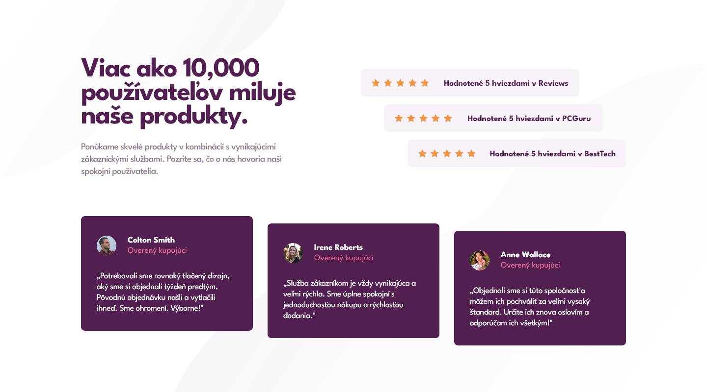
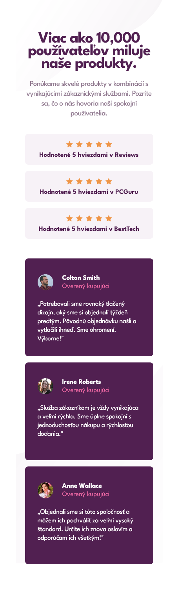

# Frontend Mentor - Social proof section

## 📝 Informácie o projekte

Tento projekt je zo stránky Frontend Mentor ([Social proof section](https://www.frontendmentor.io/challenges/social-proof-section-6e0qTv_bA)). Projekty zo stránky Frontend Mentor pomáhajú zlepošovať "coding skills" na realistických projektoch. Predlohy projektov sú dostupné na Figme. Anglické texty som upravil na slovenské.

## 🏗️ Vytvorenie projektu

Tento projekt som vytvoril pomocou HTML, CSS a SCSS. SCSS som skúšal použiť prvýkrát. Najviac času mi zabrala vizuálna úprava kódu a pomenovávanie classov. V tomto projekte mi išlo o vytvorenie "ukážkového/najlepšieho" kódu, aký viem po troch mesiacoch učenia frontedu napísať (ukážkový/najlepší treba brať trochu s rezervou).

#### [Odkaz na hotovu stránku](https://tomasdunik.github.io/frontend-mentor__social-proof-section/)

## 📸 Screenshots

### 💻 Desktop

### 📱 Mobil

## 🔗 Odkazy

- [Môj projekt na stránke Frontend Mentor](https://www.frontendmentor.io/solutions/my-version-social-proof-section-Hj08oYlN0T)
- [Moje ostatné projekty na stránke Frontend Mentor](https://www.frontendmentor.io/profile/WeekendsProgrammer)
